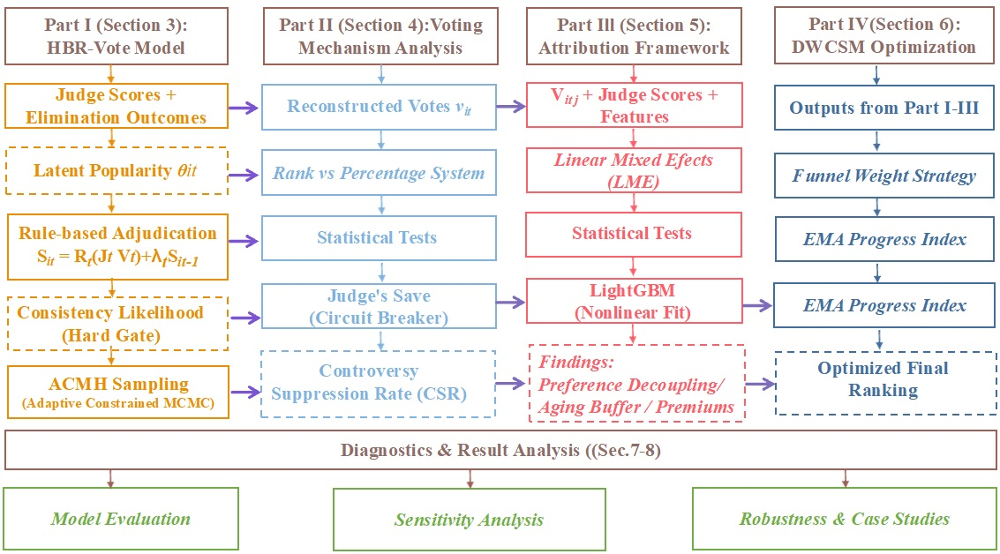

# 2026 MCM Problem C — Team 2624654

2026 Mathematical Contest in Modeling (MCM), Problem C（*Dancing with the Stars* 投票与淘汰机制）投稿论文。

**Award: Meritorious Winner (M奖)**  
2026 年全球约 **7%** 的队伍获此奖（C 题：954 / 13,185）。

## Contents

- `2624654.pdf` — Final submitted paper
- `2026_MCM-ICM_latex/` — LaTeX source, figures, and references

## Model Overview



## Problem & Approach

节目淘汰由评委分与粉丝票共同决定，但粉丝票不公开。我们围绕「还原潜在粉丝票 → 比较规则 → 归因驱动因素 → 优化机制」展开。

### Task 1 — 潜在粉丝票重构

把选票还原看成**不适定反问题**：已知评委分与淘汰结果，反推每周粉丝票份额。

- 建立分层贝叶斯框架 **HBR-Vote**，用分层先验 + 规则一致性约束刻画票仓演化  
- 用自适应约束 MCMC（**ACMH**）采样后验，给出点估计与不确定性  
- 34 季上淘汰一致性约 **99.62%**；赛程后期选手减少时不确定性明显上升

### Task 2 — 投票机制对比

在 Task 1 还原结果上，对比 **Rank 制** 与 **Percentage 制**，并回测 **Judge's Save**。

- Percentage 制对粉丝意图更敏感（约 **+13.6%**），极端人气更容易压过技术标准  
- 将 Judge's Save 建模为非线性「熔断」；混合机制争议抑制率（CSR）约 **89.5%**，可纠正如 Bobby Bones 类争议结果

### Task 3 — 表现驱动因素归因

量化职业舞伴与明星特征对评委分、粉丝人气的差异化影响。

- 先用 **LME** 剥离赛季固定效应，再用 **LightGBM + SHAP** 解释非线性贡献  
- 评委偏「技术审计」（职业舞伴胜率效应约强 **2.1×**；运动员有技术溢价）  
- 粉丝偏「身份叙事」（真人秀明星有亲近感溢价）；资深职业舞伴对年长明星有 **aging-buffer** 保护作用  
- 评委–粉丝偏好解耦（相关系数约 **0.47**）

### Task 4 — 评分机制优化

提出 **动态加权综合评分模型（DWCSM）**：

- 「漏斗策略」：随赛程推进逐步提高技术权重，让冠军回归专业标准  
- 用 **EMA** 进度指数刻画「成长叙事」，缓解粉丝票幂律偏倚  
- Season 27 反事实模拟中，将争议选手调整至第 4，在公平性与观赏性之间取得 Pareto 改进

### Task 5 — 给制作方的建议备忘录

综合上述结果，写成面向制作方的决策备忘录：规则演进、争议熔断与动态加权等可操作建议。

## Build

Requires a TeX distribution with the `mcmthesis` document class (e.g. TeX Live).

```bash
cd 2026_MCM-ICM_latex
xelatex MCM-ICM_Summary.tex
xelatex MCM-ICM_Summary.tex
```

## Team

- Team Control Number: **2624654**
- Problem: **C**
- Award: **Meritorious Winner (M奖)** — 全球获奖率约 **7%**
